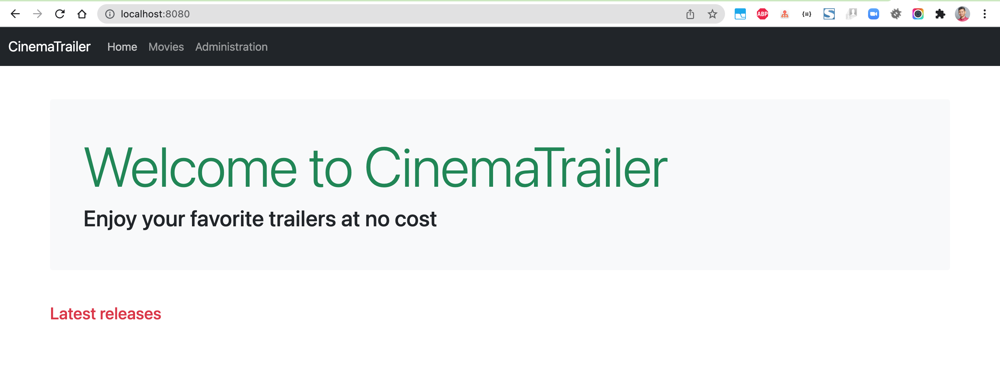
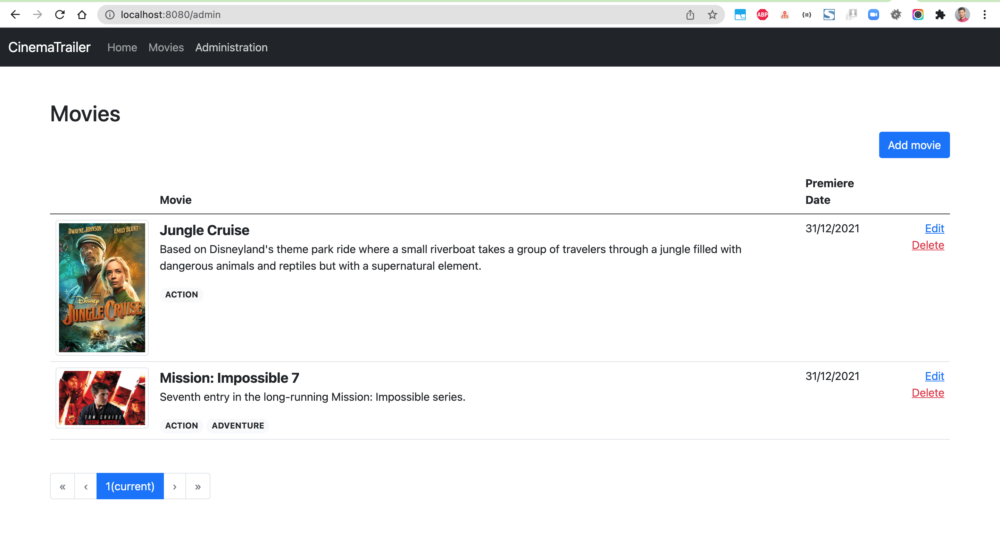
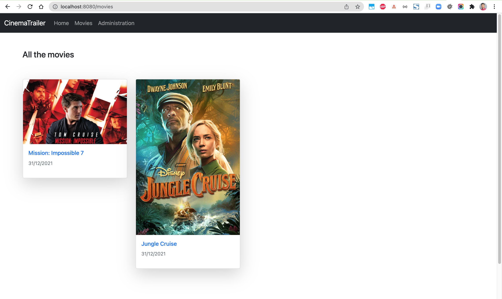
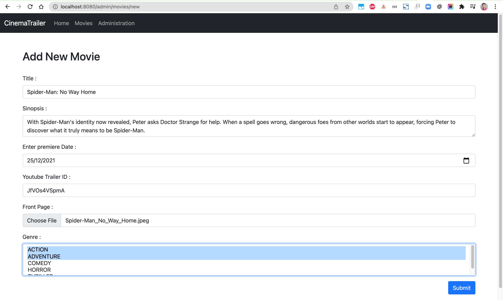
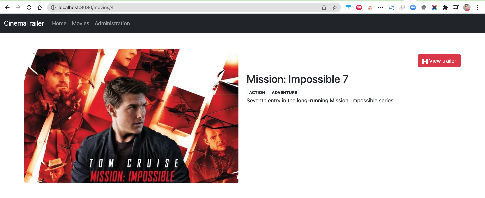
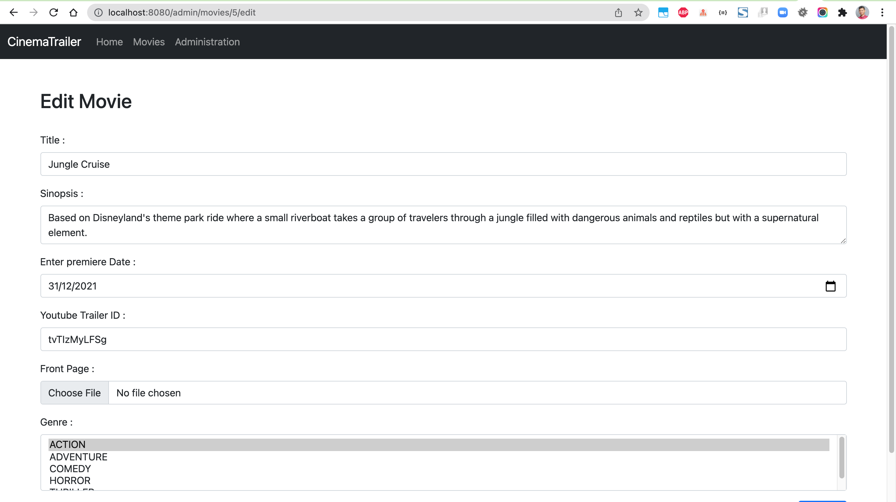

# spring-boot-movie-trailers
### Things todo list:
1. Clone this repository: `git clone https://github.com/hendisantika/spring-boot-movie-trailers.git`
2. Navigate to the folder: `cd spring-boot-movie-trailers`
3. Run the application: `mvn clean spring-boot:run`
4. Open your favorite browser: http://localhost:8080

### Docker Compose Deployment

You can also run the application using Docker Compose:

```bash
docker-compose up -d
```

### Kubernetes Deployment

For deploying the application on Kubernetes, refer to the [Kubernetes Deployment Guide](k8s/README.md).

### Image Screen Shot

Home Page



Admin Page



Movies List



Add New Movie



Details Movie



Edit Movie


